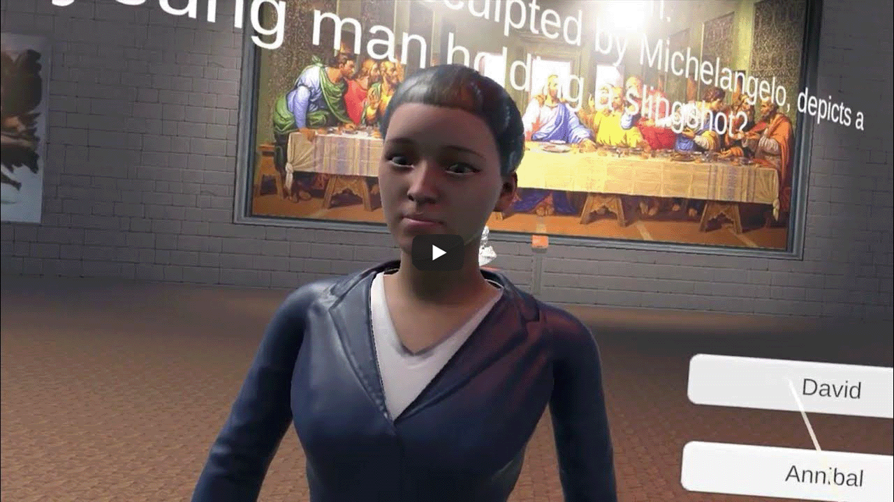
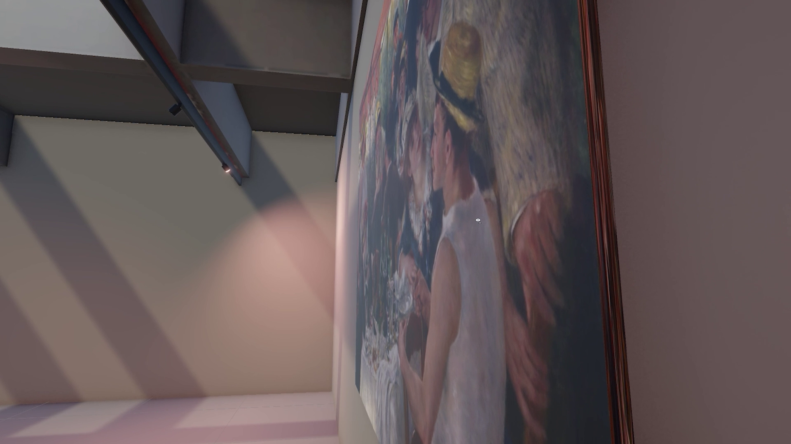
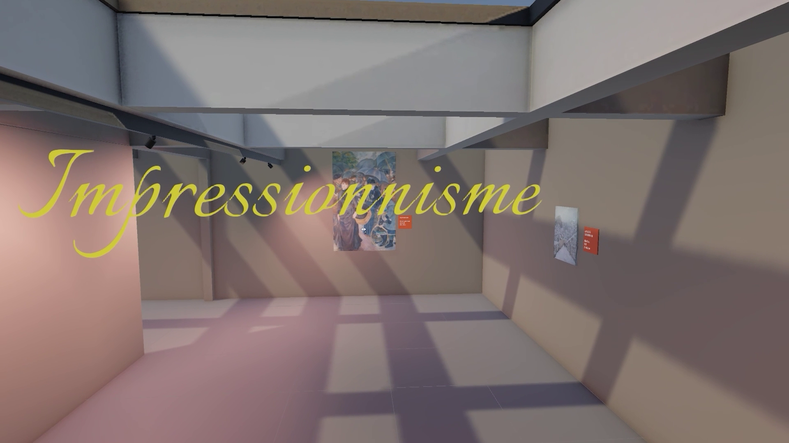
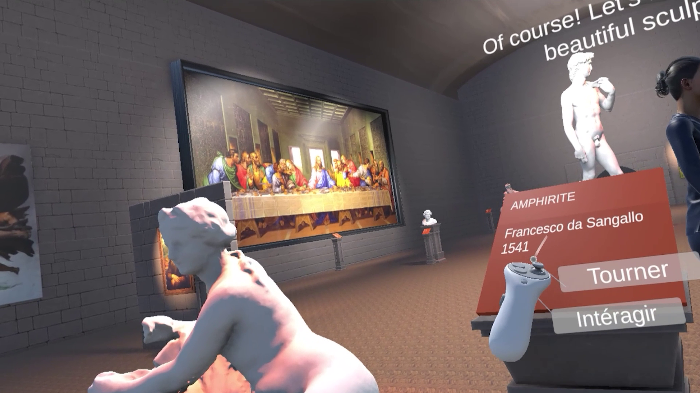

# 🏛️ Athena Museum – A Virtual AI-Powered Museum Tour  

🎨 **Explore the Renaissance and Impressionist eras in an immersive VR experience!**  
🗣️ **Chat with an AI guide using your voice and get real-time responses!**  

Welcome to **Athena Museum**, a next-gen virtual museum where history meets cutting-edge AI. Put on your VR headset and step into two meticulously designed art galleries:  

✨ **Renaissance Hall** – Dive into the masterpieces of Da Vinci, Michelangelo, and Raphael.  
🎨 **Impressionist Hall** – Experience the vibrant strokes of Monet, Van Gogh, and Renoir.  

But what makes **Athena Museum** truly special? 🤔  
💡 **An AI-powered museum guide**—controlled by none other than ChatGPT! Speak naturally, ask questions, and enjoy an interactive learning experience like never before.  

---

## 🎥 Trailer  
🚀 Watch Athena Museum in action:  
  

---

## 📸 Screenshots  
### AI Guide in Action  
  

### Close-up of an Art Piece  
  

### Renaissance Room  
  

### Impressionist Hall  
  

### VR Controls  
  

### Interactive Quiz Feature  
  

---

## 🛠️ Technologies Used  
This project combines the power of AI, VR, and real-time voice interaction:  

🧠 **AI-powered guide** – Your virtual museum guide is driven by ChatGPT.  
🎙️ **Voice interaction** – Speak naturally, and the AI responds in real-time!  
🔊 **Speech-to-Text** – Powered by Meta’s WithAI API.  
🗣️ **Text-to-Speech** – Using **Unity Sentis** to run **Jets**, delivering realistic AI voices.  
🎮 **Built with Unity** – Seamlessly integrated for an immersive VR experience.  
🔗 **Powered by OpenAI** – For intelligent, natural conversations.  

---

## 🚀 How to Play  
1. **Put on your VR headset.**  
2. **Enter Athena Museum and explore** the Renaissance and Impressionist halls.  
3. **Talk to the AI guide** by speaking naturally—ask about artworks, artists, or history.  
4. **Listen as the AI responds** with a dynamic voice!  

---

## 🏗️ Future Improvements  
🔹 More galleries with different art styles!  
🔹 AI guide with deeper contextual memory.  
🔹 Enhanced voice synthesis for even more natural responses.  

---

## 🤝 Thanks & Credits
* Thanks to **[@Tamulur](https://github.com/Tamulur)** who's work inspired this project
* Credits to **Masayoshi Soken** for the backgroud music ([Skylord](https://www.youtube.com/watch?v=N_XKj0mv40k) from FFXIV)
* This project was made by **[@lucaschlm](https://github.com/lucaschlm) (Lucas)**, **[@Lecouric](https://github.com/Lecouric) (Nathan)** and **[@JacquesDkz](https://github.com/JacquesDkz) (Jacques)** 

---

## 📜 License  
MIT License – Use, modify, and share freely!  

---  

This README now includes engaging screenshots and a trailer to showcase **Athena Museum** in the best possible way! 🚀

